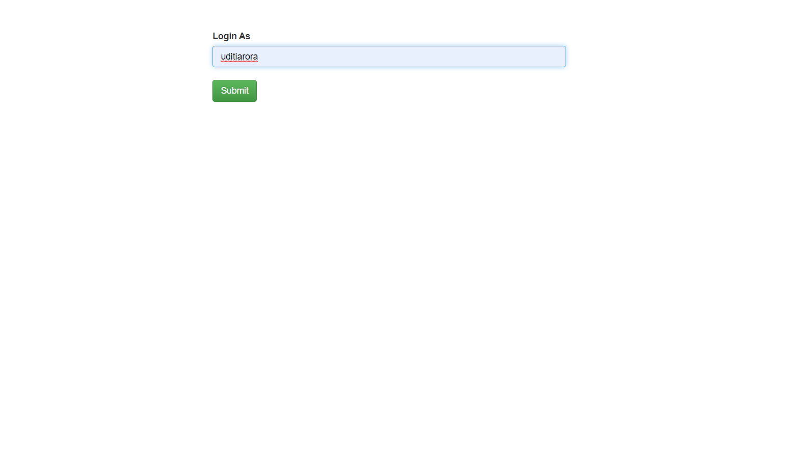
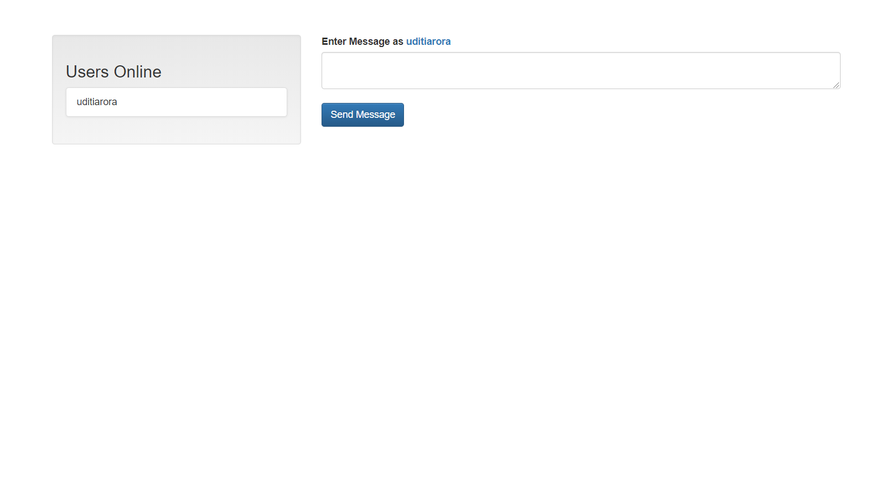

# MiniChatApp


## How to install

1. Clone the repo

```bash
$ git clone https://github.com/uditiarora/MiniChatApp/
```

2. Install package dependencies

```bash
$ yarn
// or
$ npm install
```

3. Run the server

```bash
$ node socket
```

4. Open app in browser: http://localhost:3000

## Screenshots

##### Login


##### Chat



